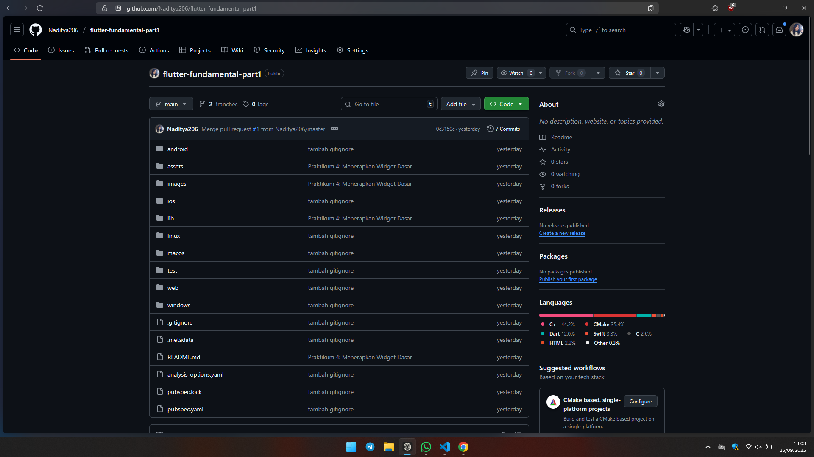
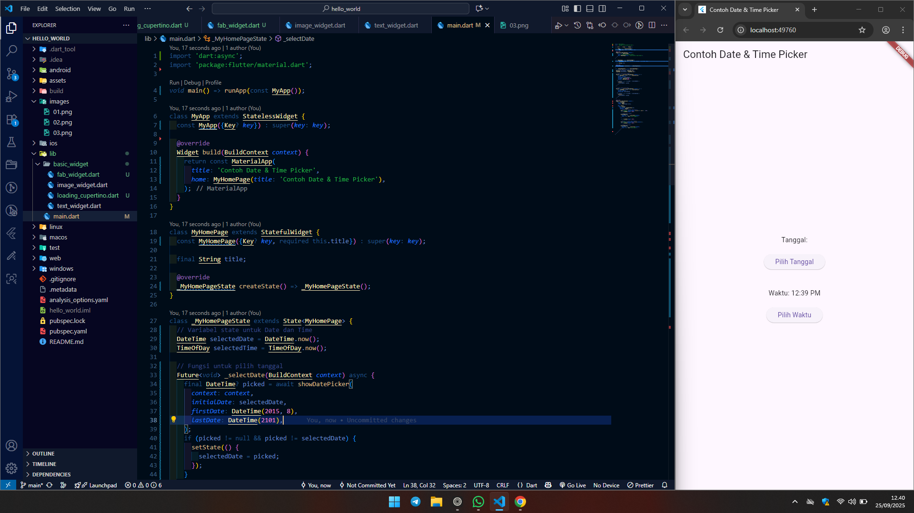

  # 📘 Praktikum Pemrograman Mobile 05
  
  **Nama**  : Naditya Prastia Andino
  **NIM**   : 244107023008
  **Kelas** : TI-3H  

---

# Praktikum 1: Membuat Project Flutter Baru


## 🔹 Langkah 1: Membuka Command Palette

1. Buka **VS Code**.
2. Tekan shortcut berikut (untuk Windows):

   ```
   Ctrl + Shift + P
   ```
3. Akan muncul **Command Palette**.
4. Ketik `Flutter`, lalu pilih opsi **New Application Project**.

📌 **Catatan:**

* Jika shortcut tidak berfungsi, bisa gunakan menu:

  ```
  View > Command Palette
  ```

---

## 🔹 Langkah 2: Memilih Lokasi Project

1. Tentukan folder tempat project akan dibuat.

   * Disarankan di folder **Documents** atau **Desktop**.
   * Jangan gunakan folder dengan path yang terlalu panjang.
2. Klik **Select a folder to create the project in**.

---

## 🔹 Langkah 3: Menentukan Nama Project

1. Masukkan nama project:

   ```
   hello_world
   ```
2. Tekan **Enter**, lalu tunggu hingga proses selesai.

📌 **Aturan penamaan project Flutter:**

* Wajib menggunakan huruf **kecil semua (lowercase)**.
* Tidak boleh menggunakan **spasi**.
* Jika lebih dari satu kata, gunakan **underscore (\_)**.
* Tidak boleh diawali angka atau simbol khusus.
* Nama project **berbeda** dengan nama aplikasi yang tampil di **Play Store/App Store** (nama aplikasi dapat diatur saat deployment).

---

## 🔹 Langkah 4: Konfirmasi Project Baru

* Setelah proses selesai, akan muncul pesan berikut di VS Code:

  ```
  Your Flutter Project is ready!
  ```


# Praktikum 2: Menghubungkan Perangkat Android atau Emulator

Dikarenakan saya menggunakan iPhone sebagai gantinya menggunakan emulator berbasis Website Chrome


# Praktikum 4: Menerapkan Widget Dasar


# 9. Praktikum 4: Menerapkan Widget Dasar


Siap 👍 berikut saya buatkan **laporan Praktikum 4** dalam format **Markdown (README.md)**:

---

# 📘 Praktikum 4: Menerapkan Widget Dasar

## 🔹 Langkah 1: Text Widget

* Membuat file `text_widget.dart` di folder `lib/basic_widgets/`.
* Kode program:

```dart
import 'package:flutter/material.dart';

class MyTextWidget extends StatelessWidget {
  const MyTextWidget({Key? key}) : super(key: key);

  @override
  Widget build(BuildContext context) {
    return const Text(
      "Nama saya [Nama Lengkap Anda], sedang belajar Pemrograman Mobile",
      style: TextStyle(color: Colors.red, fontSize: 14),
      textAlign: TextAlign.center,
    );
  }
}
```

📌 **Catatan:**

* Gantilah `[Nama Lengkap Anda]` dengan nama lengkap Anda.
* Import `text_widget.dart` ke dalam `main.dart`.
* Hasil tampilan berupa teks berwarna merah, rata tengah.

---

## 🔹 Langkah 2: Image Widget

* Membuat file `image_widget.dart` di folder `lib/basic_widgets/`.
* Kode program:

```dart
import 'package:flutter/material.dart';

class MyImageWidget extends StatelessWidget {
  const MyImageWidget({Key? key}) : super(key: key);

  @override
  Widget build(BuildContext context) {
    return const Image(
      image: AssetImage("logo_polinema.jpg"),
    );
  }
}
```

📌 **Langkah tambahan:**

1. Tambahkan aset pada file `pubspec.yaml`:

```yaml
flutter:
  assets:
    - logo_polinema.jpg
```

2. Simpan file gambar `logo_polinema.jpg` ke dalam folder `assets` project `hello_world`.
3. Import `image_widget.dart` ke dalam `main.dart`.
4. Hasil tampilan berupa gambar logo sesuai aset yang ditambahkan.

## 📌 Kesimpulan

Pada praktikum ini dipelajari dua widget dasar di Flutter, yaitu:

* **Text Widget** → untuk menampilkan teks dengan pengaturan warna, ukuran, dan posisi.
* **Image Widget** → untuk menampilkan gambar dari file aset aplikasi.

Kedua widget ini merupakan elemen fundamental dalam membangun tampilan antarmuka aplikasi Flutter.

---

# 📱 Praktikum 5: Menerapkan Widget Material Design dan iOS Cupertino




Baik, berikut penjelasan singkat dari **Praktikum 5: Menerapkan Widget Material Design dan iOS Cupertino** dalam format **Markdown**:

---

## 🔹 Langkah 1: Cupertino Button dan Loading Bar
- Menggunakan **CupertinoButton** (gaya iOS) dan **CupertinoActivityIndicator** sebagai loading bar.
- Membuat tombol sederhana dan indikator loading.

---

## 🔹 Langkah 2: Floating Action Button (FAB)
- Menggunakan **FloatingActionButton** (Material Design).
- Tombol bulat melayang yang sering dipakai untuk aksi utama pada aplikasi (contoh: like, tambah data).

---

## 🔹 Langkah 3: Scaffold Widget
- **Scaffold** digunakan untuk membuat kerangka dasar aplikasi.
- Menyediakan struktur standar: AppBar, Body, FloatingActionButton, BottomNavigationBar.
- Contoh: aplikasi counter dengan tombol `+`.

---

## 🔹 Langkah 4: Dialog Widget
- Dialog digunakan untuk menampilkan pesan pop-up.
- Dua jenis utama: **AlertDialog** dan **SimpleDialog**.
- Contoh: tombol menampilkan **AlertDialog** dengan tombol `OK`.

---

## 🔹 Langkah 5: Input dan Selection Widget
- Flutter menyediakan widget untuk input pengguna:
  - **Checkbox**
  - **Radio Button**
  - **Slider**
  - **Switch**
  - **TextField**
- Contoh: **TextField** untuk input nama dengan `OutlineInputBorder`.

---

## 🔹 Langkah 6: Date and Time Pickers
- Widget untuk memilih tanggal dan waktu.
- Menggunakan **showDatePicker()** untuk membuka kalender.
- Hasil tanggal ditampilkan pada layar.

---

# Hasil Code 

```dart
import 'dart:async';
import 'package:flutter/material.dart';

void main() => runApp(const MyApp());

class MyApp extends StatelessWidget {
  const MyApp({Key? key}) : super(key: key);

  @override
  Widget build(BuildContext context) {
    return const MaterialApp(
      title: 'Contoh Date & Time Picker',
      home: MyHomePage(title: 'Contoh Date & Time Picker'),
    );
  }
}

class MyHomePage extends StatefulWidget {
  const MyHomePage({Key? key, required this.title}) : super(key: key);

  final String title;

  @override
  _MyHomePageState createState() => _MyHomePageState();
}

class _MyHomePageState extends State<MyHomePage> {
  // Variabel state untuk Date dan Time
  DateTime selectedDate = DateTime.now();
  TimeOfDay selectedTime = TimeOfDay.now();

  // Fungsi untuk pilih tanggal
  Future<void> _selectDate(BuildContext context) async {
    final DateTime? picked = await showDatePicker(
      context: context,
      initialDate: selectedDate,
      firstDate: DateTime(2015, 8),
      lastDate: DateTime(2101),
    );
    if (picked != null && picked != selectedDate) {
      setState(() {
        selectedDate = picked;
      });
    }
  }

  // Fungsi untuk pilih waktu
  Future<void> _selectTime(BuildContext context) async {
    final TimeOfDay? picked = await showTimePicker(
      context: context,
      initialTime: selectedTime,
    );
    if (picked != null && picked != selectedTime) {
      setState(() {
        selectedTime = picked;
      });
    }
  }

  @override
  Widget build(BuildContext context) {
    return Scaffold(
      appBar: AppBar(
        title: Text(widget.title),
      ),
      body: Center(
        child: Column(
          mainAxisSize: MainAxisSize.min,
          children: <Widget>[
            // Menampilkan tanggal yang dipilih
            Text("Tanggal: ${selectedDate.toLocal()}".split(' ')[0]),
            const SizedBox(height: 20.0),

            // Tombol pilih tanggal
            ElevatedButton(
              onPressed: () => _selectDate(context),
              child: const Text('Pilih Tanggal'),
            ),

            const SizedBox(height: 40.0),

            // Menampilkan waktu yang dipilih
            Text("Waktu: ${selectedTime.format(context)}"),
            const SizedBox(height: 20.0),

            // Tombol pilih waktu
            ElevatedButton(
              onPressed: () => _selectTime(context),
              child: const Text('Pilih Waktu'),
            ),
          ],
        ),
      ),
    );
  }
}
```


